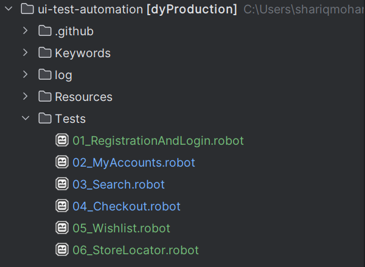
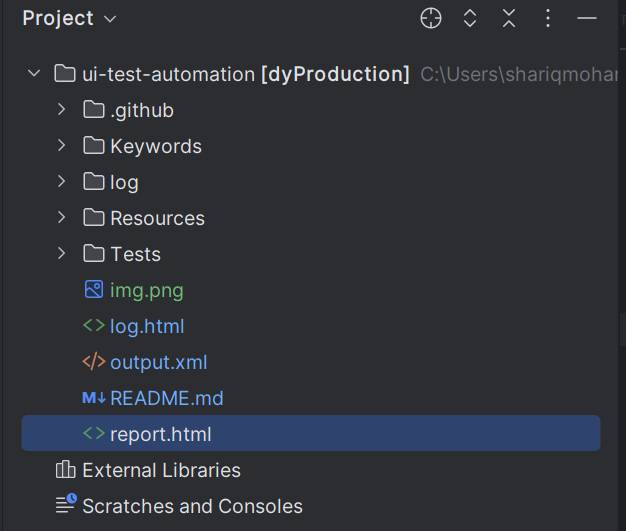

Getting Started
To use this script, follow the instructions below:

# **Prerequisites**

#### Python installed on your system
###### Follow the link for python installation: https://robotframework.org/robotframework/latest/RobotFrameworkUserGuide.html#python-installation

#### Robot Framework installed
###### Robot framework can be installed using command `-pip install robotframework`

#### Clone DY PROD Checklist from repo
Clone Repository from https://github.com/david-yurman/ui-test-automation.git

 `git clone https://github.com/david-yurman/ui-test-automation.git`

#### Description

Prod Checklist covers the portal functionalities and confirms build stability on DY production environment.
The test scenarios covers Registration, Login, My Accounts, Product Search and Sort, Store Locator, Wishlist and Checkout scenarios.
Test Folders are separated likely:

##### Test run can be trigger either for IDE or Command Prompt.

###### To run from Command Line:
Go to Project path
`cd /project path`

Run Command:
`python -m robot  --variable run_on_LT:<LT_RUN> --variable de
vice:<broswer/device> --variable version:<browser-version>  --variable  platform:"<OS-Platform>" --variable shopLocale:<locale>   .\Tests\`

<LT_RUN> - To run test on lamda test. - Yes/No
<browser/device> -  required browser or mobile device  - chrome/firefox/safari
<browser-version> - required version of browser - 17.5/17 etc
<OS-Platform> - required OS - macOS Catalina/windows11/Linux etc
<locale> - required location - US/UK/FR/CN

To run from IDE: 
An IDE of you choice can be used Pycharm, VSCode etc

Reports will be generated on

